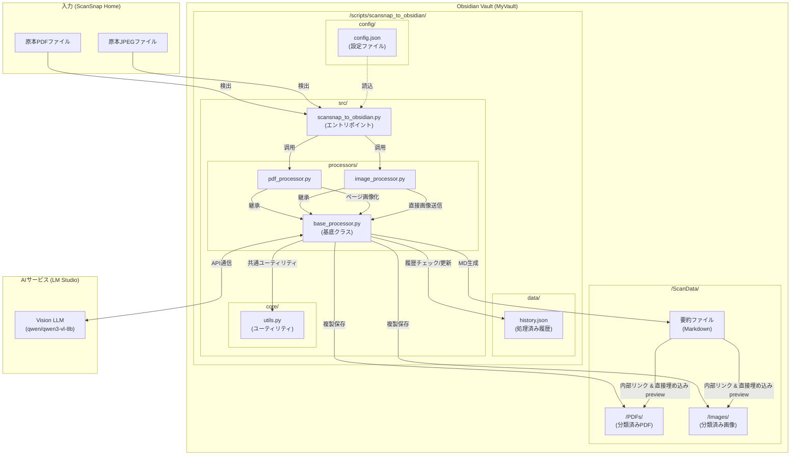

# ScanSnap-Obsidian 連携システム 構成図 (最新版)

このドキュメントは、プロジェクトのモジュール化およびフォルダ階層整理後の最新システム構成を示します。

## システム全体図

## ディレクトリ構造と役割

| ディレクトリ/ファイル         | 役割                                                                           |
| :---------------------------- | :----------------------------------------------------------------------------- |
| `src/scansnap_to_obsidian.py` | プログラムのエントリポイント。設定に従いPDF/JPEG処理を振り分けます。           |
| `src/processors/`             | フォーマットごとの処理ロジック。                                               |
| ├ `base_processor.py`         | AI通信、MD生成、ファイル操作などの共通ワークフローを定義。                     |
| ├ `pdf_processor.py`          | PDFの画像化、サンプリング処理。                                                |
| └ `image_processor.py`        | JPEGファイルの処理（1ファイル1書類）。                                         |
| `src/core/utils.py`           | ファイル名サニタイズ、和暦変換、日付抽出などの汎用関数。                       |
| `config/config.json`          | 入出力ディレクトリ、AIプロンプト、カテゴリ分類ルールなどの設定。               |
| `data/history.json`           | 処理済みファイルの履歴。重複処理を防止します（`config.json` でパス変更可能）。 |
| `doc/`                        | 設計ドキュメント。                                                             |
| `tests/`                      | テストコード（リネームロジックの検証など）。                                   |

## 処理フロー

1.  **起動 & 設定読込**: `Main` が `config.json` を読み込み、スキャン対象ディレクトリを特定します。
2.  **ファイル検出**: 拡張子に応じて、`PDFProcessor` または `ImageProcessor` をインスタンス化します。
3.  **画像準備**: 
    - PDFの場合：`fitz` を使用して各ページを画像化し、必要に応じてサンプリングします。
    - JPEGの場合：そのまま処理対象画像とします。
4.  **AI解析**: `BaseProcessor` が Vision LLM に画像を送信し、タイトル、カテゴリ、日付等を抽出します。
5.  **後処理**:
    - AIの出力に基づき、出力パスを計算（リネーム案作成）。
    - Obsidian 用の要約 Markdown ファイルを生成。
    - **原本ファイル（PDF/JPEG）を Wikilink (`![[...]]`) で埋め込み、直接プレビュー可能にします。**
    - ファイル（PDF/JPEG）を `ScanData` 以下の適切なフォルダに複製・整理。
    - 処理結果を `history.json` に記録。

## フォーマット固有の仕様

### PDF処理
- 全ページを画像化した後、コンテキスト節約のため最大5ページ（設定可能）をサンプリングしてAIに送信します。
- 原本PDFは `ScanData/PDFs/` 以下のカテゴリ別フォルダにリネーム（任意）してコピーされます。

### JPEG処理
- 画像1ファイルを1書類として扱います。
- 原本画像は `ScanData/Images/` 以下のカテゴリ別フォルダにリネーム（任意）してコピーされます。
